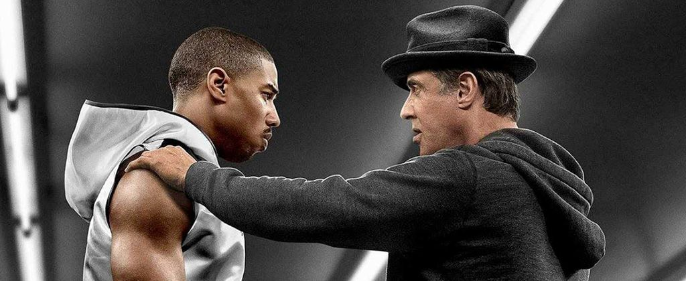

#Primera pelicula
## Creed 1 

***

***

## Resumen
Creed (titulada: Creed: Corazón de campeón en Hispanoamérica y Creed: La leyenda de Rocky en España) es una película estadounidense del género deportivo-dramático de 2015, escrita y dirigida por Ryan Coogler y coescrita por Aaron Covington. La película está protagonizada por Michael B. Jordan y Sylvester Stallone. También cuenta con las actuaciones de Tessa Thompson, Tony Bellew y Phylicia Rashad. Es la séptima película en la que aparece el personaje de Rocky Balboa y se trata un spin-off de la saga. Es la única película de la serie que no ha sido escrita por Sylvester Stallone. La película recibió reseñas sumamente positivas de parte de la crítica y audiencia. En Rotten Tomatoes posee una aprobación de 95% y en IMDb 7,6/10.

El rodaje comenzó el 19 de enero de 2015, en Inglaterra, (en Goodison Park, Liverpool), y luego continuó en la ciudad de Filadelfia. La cinta fue estrenada el 25 de noviembre de 2015 en los Estados Unidos, el 26 de noviembre en Argentina y el 4 de diciembre de 2015 en Suecia y Rusia. El tráiler fue publicado el 30 de junio de 2015 en la web de Warner Bros., así como en sus cuentas de redes sociales e Internet.

Stallone ganó el Globo de Oro a Mejor actor secundario por el papel de Rocky y fue nominado al Óscar en la misma categoría. En ambos premios es su tercera nominación -Óscar y Globos de Oro- y la primera que gana -Globos de Oro-. Anteriormente fue nominado por el papel de Balboa como Mejor Actor y como Mejor Guion en 1977.

## Sinopsis
- Adonis Johnson no llegó a conocer a su padre, el campeón del mundo de los pesos pesados Apollo Creed, que falleció antes de que él naciera.
- Sin embargo, nadie puede negar que lleva el boxeo en la sangre, por lo que pone rumbo a Filadelfia, el lugar en el que se celebró el legendario combate entre su padre y Rocky Balboa. Una vez allí, Adonis busca a Rocky y le pide que sea su entrenador.
- A pesar de que este insiste en que ya ha dejado ese mundo para siempre, Rocky ve en Adonis la fuerza y determinación que tenía su enconado rival, y que terminó por convertirse en su mejor amigo.
- Finalmente, acepta entrenarle a pesar de estar librando su propio combate contra un rival más letal que cualquiera a los que se enfrentó en el cuadrilátero.

***

***
