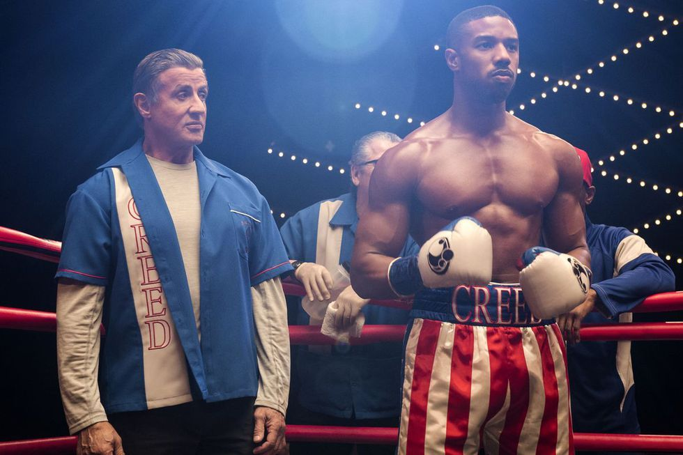

# Segona pelicula
##  creed 2

***

***

## Resumen
Creed II (titulada: Creed II: Defendiendo el legado en Hispanoamérica y Creed II: La leyenda de Rocky en España) es una película estadounidense de 2018 perteneciente al género de drama deportivo, dirigida por Steven Caple Jr. y escrita por Sylvester Stallone y Cheo Hodari Coker. Secuela de la película Creed, del año 2015, y la octava entrega de la serie de películas de Rocky, está protagonizada por Michael B. Jordan, Sylvester Stallone, Tessa Thompson, Dolph Lundgren, Florian Munteanu, Phylicia Rashad, Andre Ward y Wood Harris, todos los cuales repiten sus roles de películas anteriores, excepto Munteanu, quien se sumó al elenco para interpretar al hijo de Ivan Drago. El guionista y director de Creed Ryan Coogler se desempeña como productor ejecutivo de la película. La trama sigue el entrenamiento de Adonis Creed para vencer al célebre hijo de Ivan Drago, el boxeador que mató a su padre en el cuadrilátero hace 30 años. Fue lanzada en Estados Unidos el 22 de noviembre de 2018, y está dedicada a Tony Burton, quien apareció en seis de las películas de Rocky y falleció en febrero del año 2016

## Sinopsis
- Adonis Creed se debate entre las obligaciones personales y el entrenamiento para su próxima gran pelea, con el desafío de su vida por delante.
- Enfrentarse a un oponente que tiene vínculos con el pasado de su familia solo intensifica su inminente batalla en el ring. Afortunadamente Rocky Balboa está a su lado a lo largo de todo el camino, y juntos se cuestionarán por lo que vale la pena luchar y descubrirán que nada es más importante que la familia.
- La trama nos envuelve en las dificultades morales que acompañan al protagonista paso a paso en la cima de su carrera dejando en claro que el éxito nunca llega de manera tranquila.

***

***
