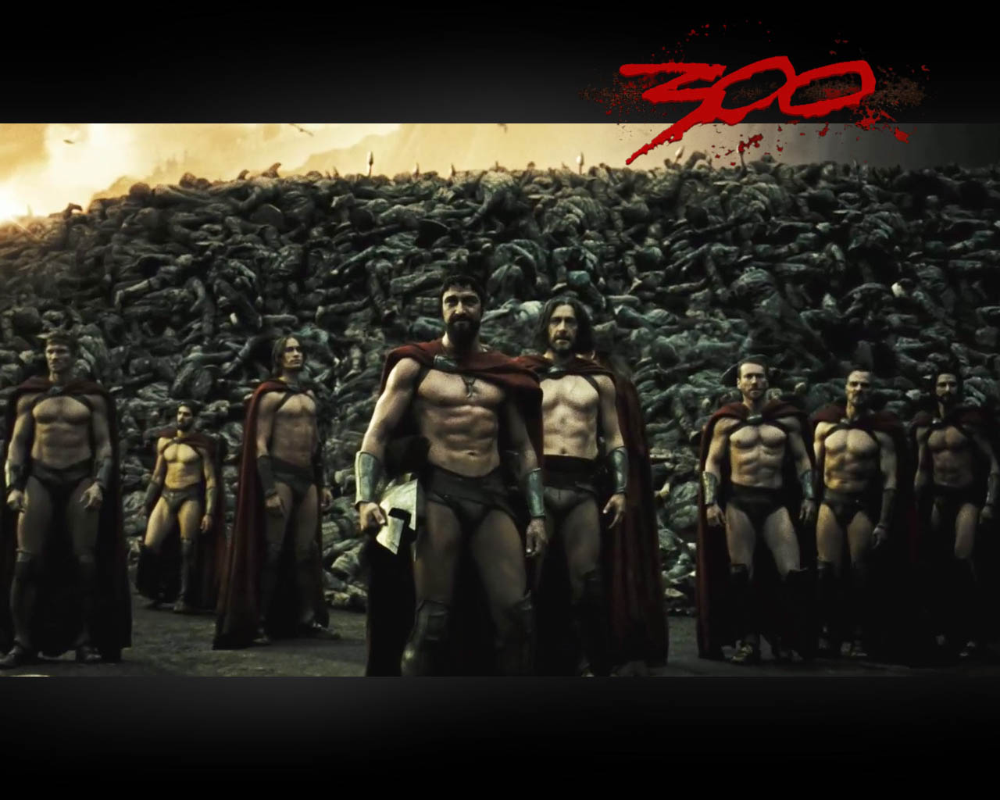

# Tercera pelicula
## 300

***

***

#Resumen

300 es una película estadounidense épica de acción del año 2007, dirigida por Zack Snyder. Es la adaptación cinematográfica de la serie limitada de cómics homónima de Frank Miller, la cual relata la Batalla de las Termópilas. Miller sirvió como productor ejecutivo y consultor. La película fue rodada en su mayoría con una técnica de superposición de croma, para ayudar a reproducir las imágenes del cómic original.

La trama describe la historia del Rey Espartano Leónidas (Gerard Butler) y sus 300 guerreros espartanos que pelearon a muerte contra el "dios-rey" persa Jerjes I (Rodrigo Santoro) y su ejército de más de 100 000 soldados. Debido al furor de la batalla, la reina espartana Gorgo (Lena Headey) intentó conseguir el apoyo de Esparta por parte del Senado Espartano. La historia es enmarcada por una narración en off del soldado Espartano Dilios (David Wenham). A través de esta técnica narrativa, varias criaturas fantásticas se introducen, colocando a 300 dentro del género de la fantasía histórica.

El 9 de marzo de 2007, 300 fue lanzada en cines convencionales e IMAX en los Estados Unidos (la película en IMAX se llamó 300: A experience in IMAX), al igual que en América Latina. La película recibió críticas mixtas, siendo aclamado su original estilo visual, así como críticas por favorecer los aspectos visuales sobre la caracterización de personajes, y su controvertida descripción sobre los antiguos persas. Aun así, 300 fue muy bien recibida por el público logrando una recaudación mundial de USD 456 068 181,3​ siendo su apertura la 24a más grande de la historia en taquillas.

300 se convirtió en la segunda película más exitosa del 2007 tan solo detrás de Piratas del Caribe: en el fin del mundo que logró una recaudación de USD 963 420 425.4​ La película obtuvo muchos galardones entre los que se encuentran Mejor Película de Pelea en los MTV Movie Awards 2007, Mejor Película del 2007 por IGN, Mejor Película de Acción, Aventura y Thriller por Saturn Awards y Mejor Adaptación de un Cómic, por IGN.

#Sinopsis
- En el año 480 a. C., el rey espartano Leónidas lidera a sus 300 soldados contra un ejército de más de un millón de soldados en la batalla de las Termópilas.

