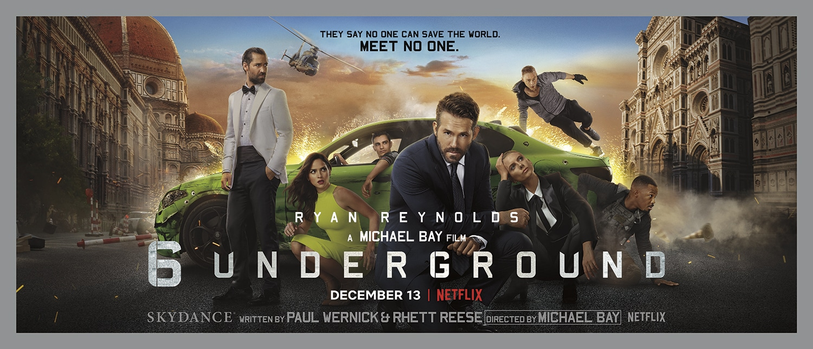
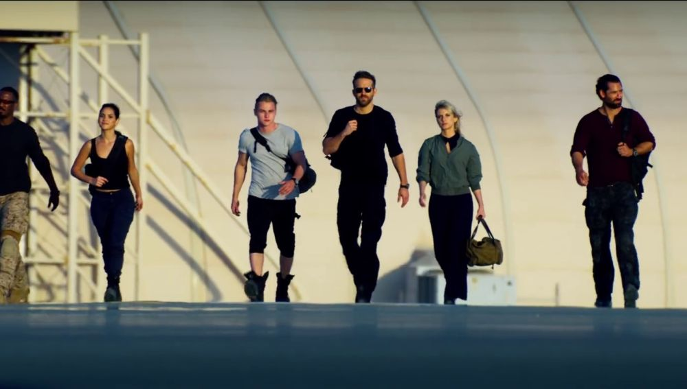

## Quarta pelicula
# 6 en la sombra

***

***

#Resumen

6 Underground (conocida en Hispanoamérica como Escuadrón 6 y en España como 6 en la sombra) es una película estadounidense de acción y comedia dirigida por Michael Bay, a partir de un guion escrito por Rhett Reese y Paul Wernick. La cinta es protagonizada por Ryan Reynolds, Mélanie Laurent, Manuel Garcia-Rulfo, Adria Arjona, Corey Hawkins, Ben Hardy y Dave Franco.3​ Bay produce la cinta junto a Ian Bryce, David Ellison, Dana Goldberg y Don Granger.

#Sinopsis
- ¿Cuál es la mejor parte de estar muerto? No se trata de escapar de tu jefe, de tu ex, de borrar tu historial criminal. 
- La mejor parte de estar muerto es la libertad. Poder acabar con gente mala de verdad, sin tener que responder ante nadie. Liderados por el enigmático Uno (Ryan Reynolds), seis individuos de distintas partes del mundo han sido elegidos no solo por su habilidad, sino por su deseo de eliminar su pasado para cambiar el futuro. Este equipo de justicieros, que han fingido su muerte, se dedican a desmantelar organizaciones criminales. Y es que, a pesar de estar muertos, harán historia.
- Esta película que dirige Michael Bay está basada en una idea original de los guionistas de las dos películas de Deadpool.

***

***
