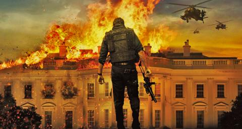

#Quinta pelicula
##objetivo: la casa blanca

***

***

#Resumen

La historia se centra en Mike Banning, un exsoldado de las Fuerzas Especiales que ahora trabaja en el Servicio Secreto junto al Presidente de los Estados Unidos, Benjamin Asher. Banning mantiene una relación personal, amable con el presidente Asher, la Primera Dama Margaret y su hijo Connor. Durante una nevada noche de Navidad en Camp David, Asher es escoltado a una campaña de recaudación de fondos, el vehículo que escoltaba al presidente sufre un accidente y queda suspendido en el vacío al borde de un puente. Banning logra salvar a Asher, pero el coche cae del puente y Margaret muere.

Dieciocho meses más tarde, después de haber sido retirado como escolta del presidente, Banning trabaja en el Departamento del Tesoro. Durante la reunión que se lleva a cabo con Asher y el primer ministro de Corea del Sur, Lee Tae-Woo, unos terroristas liderados por Kang Yeonsak, un terrorista de Corea del Norte conducido a la reunión de Corea, ejecutan un ataque aéreo pero el avión terrorista es derribado. Tras ver esto, Banning se une a la escolta de la Casa Blanca. Los terroristas atacan la Casa Blanca en un despliegue increíblemente sincronizado y logran matar a todos los guardias, menos a Banning. Asher, el primer ministro Lee, y otras personas son llevadas al búnker presidencial, pero los norcoreanos infiltrados, entre ellos Kang y el antiguo agente del Servicio Secreto, Dave Forbes, capturan a Asher y a los otros. Asher y varios altos funcionarios se mantienen como rehenes en el búnker de la Casa Blanca. El primer ministro Lee es ejecutado en un vídeo en vivo de un disparo en la cabeza, siendo presenciado por el resto del Gabinete de Gobierno, el Servicio Secreto y la Junta de Jefes Militares. Antes de su muerte, el agente Roman alerta a la Directora del Servicio Secreto de Lynne Jacobs que "Olimpo ha caído".

Kang busca utilizar como rehén a Asher para obligar a los funcionarios estadounidenses a retirar la Séptima Flota y las fuerzas estadounidenses de la península de Corea. También busca destruir el arsenal entero de armas nucleares mediante la detonación de los misiles en sus respectivos silos por todo el país, convirtiendo los EE.UU. a un páramo irradiado y estéril y matando a millones de estadounidenses en el proceso, como venganza por la muerte de su familia. Para lograr esto, se requiere el código triple de acceso a un sistema instalado en el búnker llamado Cerberus, que están en poder de tres altos funcionarios del gobierno dentro del búnker, incluido el Presidente. Asher ordena a los otros dos funcionarios que revelen sus códigos para salvar sus vidas, seguro de que él no va a revelar el suyo.

Oculto en la Casa Blanca, Banning desactiva la vigilancia interna y logra mantener contacto con Jacobs y Allan Trumbull, el Presidente de la Cámara, ahora Presidente en funciones. Banning es autorizado a proceder para salvar a Connor, al que Kang planea usar para obligar a Asher a revelar su código de Cerberus. Sin embargo, Banning logra hallar a Connor quien estaba escondido y es capaz de entregarle a los militares, frustrando el plan original de Kang. Como Banning va reduciendo el número de terroristas, Kang envía a Forbes para que lo mate. Banning encuentra a Forbes pero pronto descubre que este trabaja para Kang y ambos comienzan a luchar. Banning mata a Forbes, pero primero convence a este a informar a Kang que Banning está muerto luego de hacerle entrar en razón por haber traicionado a su país. Mientras tanto, el General Edward Clegg convence a Trumbull a un asalto aéreo en helicóptero a la Casa Blanca. Kang despliega un sistema de cañón antiaéreo avanzado en su posesión, llamado HYDRA. Descubriendo el sistema, Banning informa a Trumbull y Clegg y estos abortan la misión, pero el nuevo sistema de armas aniquila a la fuerza de asalto antes de que Banning pueda detenerlo. Kang toma represalias por el intento de asalto, matando en directo al vicepresidente Charlie Rodríguez.

Después de que Banning desactiva las comunicaciones de Kang, Kang intenta ejecutar a la secretaria de Defensa Ruth McMillan fuera de la Casa Blanca frente a los medios de comunicación. Banning logra impedir que ejecuten a McMillan, quien logra salir de la Casa Blanca con heridas de tortura. Luego, Kang falsifica su muerte y la de Asher cuando sacrifica a sus hombres y al resto de los rehenes en una explosión durante una supuesta fuga en helicóptero. Sin embargo, Banning considera que Kang ha fingido su muerte y tratará de escabullirse. El General Clegg le ordena en que aborte su intento de rescate, pero Trumbull, furioso, le ordena a este guardar silencio y le da el ultimátum a Banning de que tiene 30 minutos para rescatar al Presidente antes de retirar la Séptima Flota. Sorpresivamente y para desconocimiento del Gabinete, Kang finalmente consigue el código de Asher utilizando un algoritmo informático avanzado y logra activar Cerberus, siendo confirmado por NORAD y desatando el pánico entre el alto mando de Gobierno. Como Kang intenta escapar, Banning logra entrar al búnker y mata a los restantes terroristas, pero Kang dispara a Asher en el abdomen cuando el Presidente intenta resistirse. Esto provoca un feroz enfrentamiento entre Banning y Kang, quienes pelean mientras Cerberus está en cuenta regresiva para detonar las armas nucleares. Finalmente, Banning logra dominar a Kang y lo mata al apuñalarlo en la cabeza con un cuchillo, y luego desactiva Cerberus con la asistencia de Trumbull, con solo segundos de sobra para introducir el código de cancelación. Durante la madrugada de ese día, Banning sale con Asher herido, quien es recibido de inmediato por los soldados y paramédicos enviados a la espera de su llegada.

Después de los acontecimientos, los EE.UU. comienzan a recuperarse del ataque, mientras que Banning, una vez más, encabeza el equipo de seguridad del Presidente. El Presidente Asher se dirige al público con Banning, Jacobs, Clegg y Connor observando su discurso, mientras da palabras de aliento a todo el país después de los trágicos eventos.

#Sinopsis
-Tras un accidente en el que sólo consiguió salvar la vida del Presidente Asher (Aaron Eckhart), el agente del Servicio Secreto Mike Banning (Gerard Butler) decide dejar su puesto para trabajar en el Departamento del Tesoro.
-Pero, cuando un comando norcoreano liderado por Kang (Rick Yune) ataca la Casa Blanca y toma como rehenes al Presidente y a su equipo, Banning se verá obligado a entrar de nuevo en acción.
